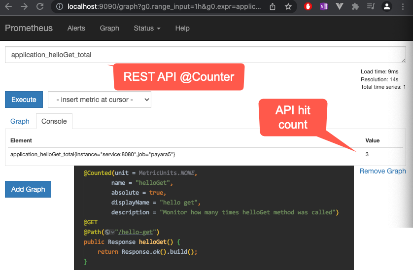
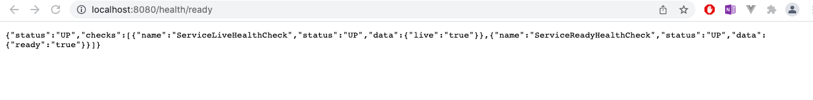

# MicroProfile generated Applications

cd service-a

## Docker build
```
cd service-a

minikube start --driver=docker
minikube -p minikube docker-env
eval$(minikube -p docker-env)

docker build -t samplemicroprofile:latest .

kubectl create secret generic database-config --from-literal=database-server=10.0.1.15 --from-literal=user=rhushi --from-literal=password=123

kubectl apply -f deployment.yaml

Wait for 5 seconds for the container to go live and then run the below command

kubectl port-forward deployment.apps/payara-sample-deployment 8080:8080 4848:4848


```

## Docker run
```

docker create network demo-net

docker run -d --rm -p 8080:8080 --name service --net demo-net samplemicroprofile:latest

service in the above argument is configured to run at port 8080 in prometheus yml file

the docker network is created so that the containers can communicate with each other  

cd src/main/prometheus/docker

docker build -t prometheus:latest .

docker run -d --rm -p 9090:9090 --name prom --net demo-net prometheus:latest


docker run -d --rm -p 8080:8080 --name payara --net demo-net samplemicroprofile:latest

curl http://localhost:8080/samplemicroprofile/data/hello/hello-get

hit the url http://localhost:8080/metrics

hit the url http://localhost:9090


```

## Edit secrets

```

To edit the secret and modify the value, run the command

echo -n "Rhushikesh123456897" | base64  
copy the returned base64 encoded value

run the command to edit the secret, the secret is opened in vi editor, paste the 
base64 encoded returned by above echo command, type :wq and save  
kubectl edit secrets database-config

```

## Re Deployment After modifying secret
```
After modifying the secret, run the commands.
kubectl delete all --all   (this does not delete the secret)

kubectl apply -f deployment.yaml

kubectl port-forward deployment.apps/payara-sample-deployment 8080:8080 4848:4848

```
## Test the application
```

http://localhost:8080/samplemicroprofile/data/hello
Output : Hello World for rhushi (this value rhushi is pushed by secret into container)

```

## Readiness and Liveness probe / Health checks

#check startup probes

http://localhost:8080/health/started

#check liveness probe
http://localhost:8080/health/live


#check readiness probe
http://localhost:8080/health/ready



#All health checks
http://localhost:8080/health/

/health/started – To check startup probes.

/health/live – To check liveness probes.

/health/ready – To check readiness probes.

/health – Accumulating all health check procedures in the application.

ServiceLiveHealthCheck implements Readiness and return live=true in call() func

ServiceReadyHealthCheck implements Readiness and return ready=true in call() func

## Autoscale
kubectl autoscale deployment deployment.apps/payara-sample-deployment --cpu-percent=50 --min=1 --max=10
